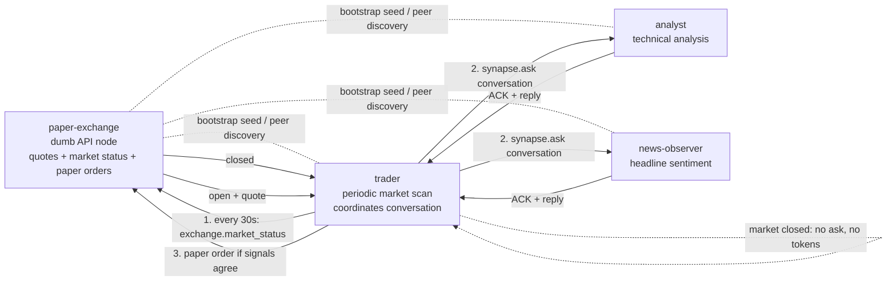

# Stock Trading Team

A tangible swarm example with three agent-like nodes and one dumb API node.

Nodes:

- `exchange.py` — a dumb paper exchange API. It provides quotes, market status, and paper order placement. It does not make decisions.
- `analyst.py` — wades into conversations with technical/risk analysis.
- `news_observer.py` — wades into conversations with mock headline sentiment.
- `trader.py` — coordinates the team, starts shared conversations, and places paper orders.



Run it in four terminals:

```bash
uv run python examples/stock_trading_team/exchange.py
uv run python examples/stock_trading_team/analyst.py
uv run python examples/stock_trading_team/news_observer.py
uv run python examples/stock_trading_team/trader.py
```

What to notice:

- The exchange is just an API node and bootstrap seed.
- The trader has a periodic market scan.
- The scan checks `exchange.market_status` first.
- If the market is closed, the trader does nothing: no ask, no agent work, no token spend.
- If the market is open, the trader broadcasts `synapse.ask`.
- Analyst and news observer opt in with ACKs and reply into the same conversation.
- The trader reads replies and may place a paper order through the exchange API.

This example intentionally keeps the “agent intelligence” fake and tiny. Synapse provides the atomics: discovery, RPC, periodic jobs, ACKs, replies, artifacts, and shared conversation IDs. A real trading system would put policy, risk checks, auth, and model calls above Synapse.

> This is a toy paper-trading demo, not financial advice.
